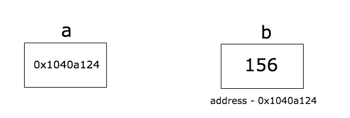

# Pointer

## Definition
- A pointer is a variable which stores the memory address of another value.


## Declaration
- ```*T``` is the type of pointer variable which points to a variable of type ```T```

## Deferencing
- Deferencing a pointer means accessing the value of a variable which a pointer points to.
- Syntax: ```*p```  

## Notes
- Zero value of pointer: ```nil``
- Another handy way to create a pointer is using ```new()``` function
- Do not pass a pointer to an array as a argument to a function. Use slice instead.
- Go does not support pointer arithmetic
    - For example, p is a pointer. ```p++``` is not allowed.